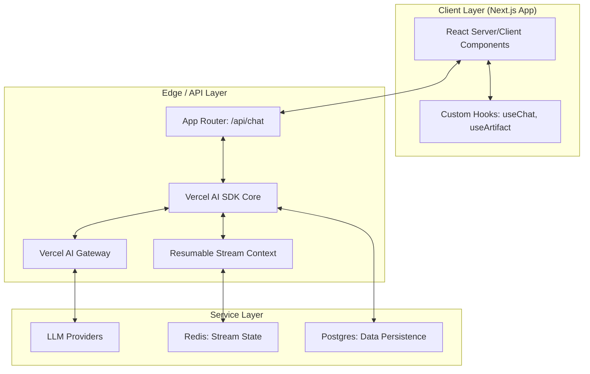
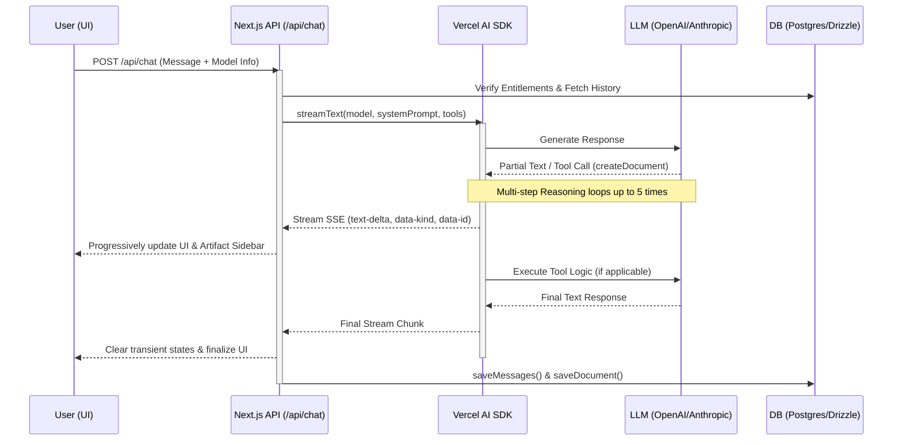

# Reasoning Chatbot

A powerful, full-stack AI chatbot template built with Next.js, featuring real-time streaming, multi-model support, interactive artifacts, and advanced document processing capabilities.

## Features

- **Next.js App Router**: Advanced routing and performance optimizations.
- **AI SDK**: Unified API for text generation, structured objects, and tool calls.
- **Multi-Model Support**: OpenAI, Anthropic, Google, xAI, and more.
- **Structured Reasoning**: Implements a clear **Intent -> Planner -> Executor** flow for complex requests.
- **Interactive Artifacts**: Side-by-side display for code, text, and data structures.
- **Document Processing**: Advanced PDF, DOCX, and CSV parsing.
- **Data Persistence**: Postgres with Drizzle ORM and Redis for stream state.
- **Authentication**: Secure login via Auth.js.

## Running Locally

1. **Clone the repository**
2. **Install dependencies**:
   ```bash
   pnpm install
   ```
3. **Set up environment variables**: Copy `.env.example` to `.env.local` and fill in your keys.
4. **Setup database**:
   ```bash
   pnpm db:migrate
   ```
5. **Start the development server**:
   ```bash
   pnpm dev
   ```

Your app should now be running on [localhost:3000](http://localhost:3000).

## Architecture Overview

The application uses a distributed, serverless architecture that prioritizes low-latency interactions and rich, stateful AI experiences.

### 1. System Topology



### 2. User Interaction Flow
This sequence illustrates how a single user prompt progresses through the system, especially when triggering an **Artifact** (Tool Call).




### 3. The AI & Streaming Lifecycle
The core of the application is a high-performance streaming pipeline that handles both text and structural metadata.

- **Streaming Protocol**: Utilizes Server-Sent Events (SSE) via `createUIMessageStreamResponse`.
- **Resumable Streams**: High-traffic or long-running requests are persisted in **Redis** using a resumable stream context.
- **Multi-Step Tool Orchestration**: The AI SDK handles up to 5 recursive tool calls per user turn.
- **Reasoning Handling**: Specialized processing for "Internal Monologue" models (e.g., Claude 3.7) and structured reasoning tools (Intent, Planner, Executor).

### 4. Modular Artifact System
Artifacts are interactive, side-by-side components that allow users to view and edit complex AI outputs.

- **Kind-Based Routing**: Supports `text`, `code`, and `sheet` artifacts.
- **Streaming Document Creation**: Transient binary data is injected into the stream to trigger sidebar activation.
- **Async Persistence**: Document states are saved to Postgres via Drizzle ORM after the stream finishes.

### 5. Tool Execution Framework
Located in `lib/ai/tools`, the toolset allows the LLM to interact with the system:
- `createDocument`: Initializes a new workspace artifact.
- `updateDocument`: Modifies existing artifacts.
- `requestSuggestions`: Generates granular edit suggestions.
- `intent`, `planner`, `executor`: Capture and display structured reasoning phases.

### 6. Data Architecture & Persistence
- **Message Versioning (`Message_v2`)**: Flexible JSON "parts" structure for tool calls and results.
- **Document Transactions**: Keyed by `id` and `createdAt` for version tracking.
- **Entitlements Layer**: Daily message quotas defined in `lib/ai/entitlements.ts`.

### 7. AI Prompt Engineering & Agent Patterns
#### A. Multi-Layered System Prompts
The final system prompt is dynamically assembled in `lib/ai/prompts.ts`:
- **`regularPrompt`**: Base assistant identity.
- **`artifactsPrompt`**: Instructions for the side-by-side UI.
- **`reasoningPrompt`**: Enforces the **Intent -> Planner -> Executor** flow.

#### B. Agentic Behavior Patterns
- **Recursive Reasoning**: Allows for multi-step thinking loops to solve complex tasks.
- **Transient Streaming**: Communicates UI-state changes instantly.
- **Feedback Loops**: Prompts instruct the agent to wait for user confirmation after major creations.

### 8. Advanced Document & File Processing
Sophisticated pipeline for handling PDF, DOCX, and CSV files:
- **Multi-Stage Lifecycle**: Upload → Parsing → Context Injection → Persistence.
- **File Processing Panel**: dedicated UI for real-time progress and previews.
- **Contextual Awareness**: Extracted text is injected into the prompt via `fileContext`.
