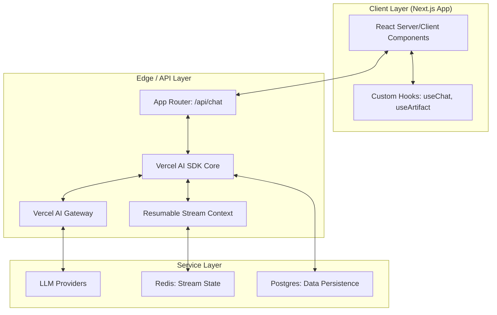
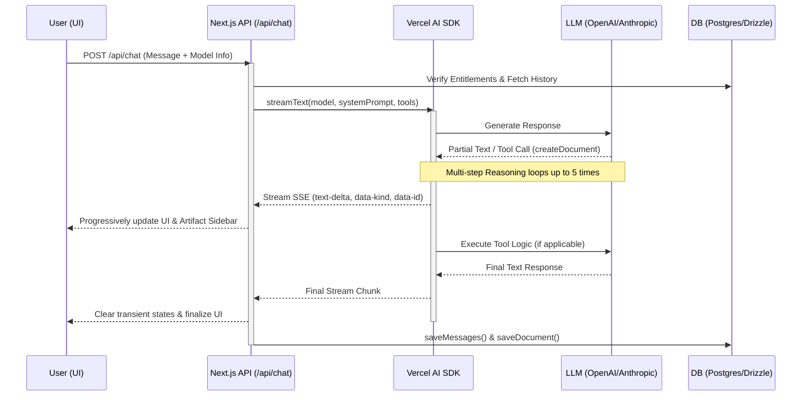

# Next.js AI Chatbot

A powerful, full-stack AI chatbot template built with Next.js, featuring real-time streaming, multi-model support, and interactive artifacts.

## Detailed End-to-End Architecture

This application is built on a distributed, serverless architecture that prioritizes low-latency interactions and rich, stateful AI experiences.

### 1. System Topology

### 2. User Interaction Flow
This sequence illustrates how a single user prompt progresses through the system, especially when triggering an **Artifact** (Tool Call).

### 3. The AI & Streaming Lifecycle
The core of the application is a high-performance streaming pipeline that handles both text and structural metadata.

- **Streaming Protocol**: Utilizes Server-Sent Events (SSE) via `createUIMessageStreamResponse`.
- **Resumable Streams**: High-traffic or long-running requests are persisted in **Redis** (if `REDIS_URL` is provided) using a resumable stream context. This allows clients to re-connect to active streams if a network interruption occurs.
- **Multi-Step Tool Orchestration**: The AI SDK handles up to 5 recursive tool calls per user turn (`stepCountIs(5)`). This enables complex workflows where the AI can check weather, create a document, and then update it based on the document's content in a single step.
- **Reasoning Handling**: Specialized processing for "Internal Monologue" models (e.g., Claude 3.7). Reasoning tokens are extracted and streamed separately from the main response to keep the UI clean while providing transparency.

### 4. Modular Artifact System
Artifacts are interactive, side-by-side components that allow users to view and edit complex AI outputs.

- **Kind-Based Routing**: The system supports `text`, `code`, and `sheet` artifacts via a modular registry (`documentHandlersByArtifactKind`).
- **Streaming Document Creation**: When a document is created:
  1. The AI calls the `createDocument` tool.
  2. Transient binary data (IDs, kinds, titles) is injected into the stream.
  3. The specific handler (e.g., `codeDocumentHandler`) takes over to stream the content.
- **Async Persistence**: Document states are saved to Postgres via **Drizzle ORM** after the stream finishes, ensuring the UI remains responsive.

### 5. Tool Execution Framework
Located in `lib/ai/tools`, the toolset allows the LLM to interact with the system and external APIs:
- `createDocument`: Initializes a new workspace artifact.
- `updateDocument`: Modifies existing artifacts using semantic descriptions.
- `requestSuggestions`: Generates granular edit suggestions for artifacts.
- `getWeather`: Demo tool for external API integration using geolocation data.

### 6. Data Architecture & Persistence
The schema (Postgres + Drizzle) is optimized for chat history and document versioning:
- **Message Versioning (`Message_v2`)**: Uses a flexible JSON "parts" structure to support text, tool calls, and tool results in a single, chronologically ordered array.
- **Document Transactions**: Documents (Artifacts) are keyed by `id` and `createdAt` to allow for version tracking and "Suggestion" overlays.
- **Entitlements Layer**: A middleware-like check ensures users stay within their daily message quotas (pro vs. free tiers) defined in `lib/ai/entitlements.ts`.

### 7. Security & Infrastructure
- **Authentication**: Powered by Auth.js (NextAuth) using local credential providers.
- **Environment Management**: Robust multi-provider support (OpenAI, Anthropic, Google, xAI) managed through the `lib/ai/providers.ts` abstraction.
- **Edge Compatibility**: The chat API is designed for the Edge Runtime to minimize cold starts and latency.

### 8. AI Prompt Engineering & Agent Patterns
The system uses a layered prompting strategy to control model behavior and UI interactions across different contexts.

#### A. Multi-Layered System Prompts
The final system prompt is dynamically assembled in `lib/ai/prompts.ts` based on the selected model and user metadata:
- **`regularPrompt`**: The base identity—a friendly, concise assistant that makes reasonable assumptions to minimize clarification questions.
- **`artifactsPrompt`**: Injected when using tool-capable models. It defines the "Artifacts Mode" (the side-by-side UI) and provides strict rules:
  - When to use `createDocument` (content > 10 lines, code, reusable items).
  - When to prefer full rewrites vs. targeted updates.
  - Usage limits (e.g., "Do not update immediately after creating").
- **`requestPrompt`**: Injected geolocation metadata (city, country, coordinates) to give the AI spatial awareness for context-specific tasks.

#### B. Specialized Artifact Agents
When a tool like `createDocument` is triggered, the system often spawns a specialized "sub-agent" flow using `streamObject`:
- **Code Agent (`codePrompt`)**: Optimized for Python generation. Enforces self-contained, executable snippets with error handling and standard library preference.
- **Sheet Agent (`sheetPrompt`)**: Specifically tuned to generate structured CSV data for interactive tables.
- **Title Agent (`titlePrompt`)**: A high-speed utility agent that summarizes conversations into 2-5 word titles without any metadata or quotes.

#### C. Agentic Behavior Patterns
- **Recursive Reasoning**: The system allows for multi-step "thinking" loops (`stepCountIs(5)`). This enables an agent to:
  1. Internalize the request (Reasoning/Thinking block).
  2. Call a tool to check state or environment.
  3. Generate content based on tool results.
  4. Optionally refine its own output in the same turn.
- **Transient Streaming**: The agent communicates UI-state changes (like opening the sidebar or changing the artifact title) through "transient" data chunks in the SSE stream, allowing the frontend to react instantly before the content even starts generating.
- **Feedback Loops**: The prompts explicitly instruct the agent to wait for user feedback after major document creations, preventing "runaway" updates and ensuring user control.